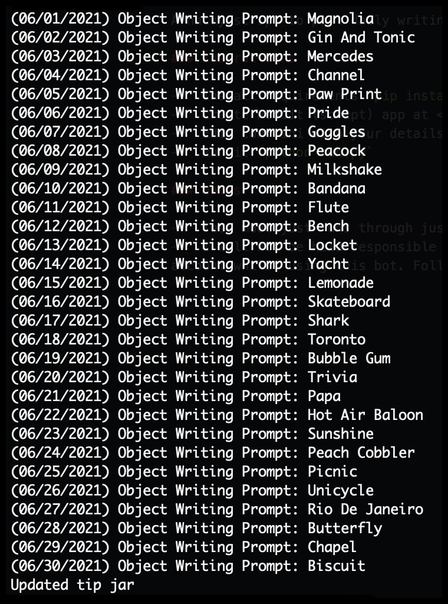

## Reddit Daily Writing Object

A hacky script to post daily writing objects. Maybes even bananas!

### Instructions

-   Install requirements `pip install -r requirements.txt`
-   Create Reddit (script) app at <https://www.reddit.com/prefs/apps/> and get keys
-   Edit conf.ini with your details and settings
-   Edit selftext.md with your post texts
-   Run it `python run.py`

### Notes

-   Test mode just runs through over a month and does not post.
-   I will not be held responsible for any bad things that might happen to you or your Reddit account whilst using this bot. Follow Reddiquette and stay safe.
